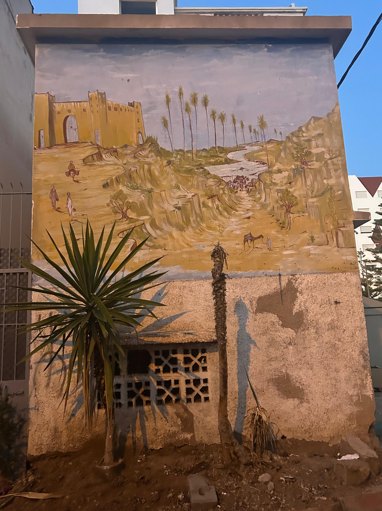
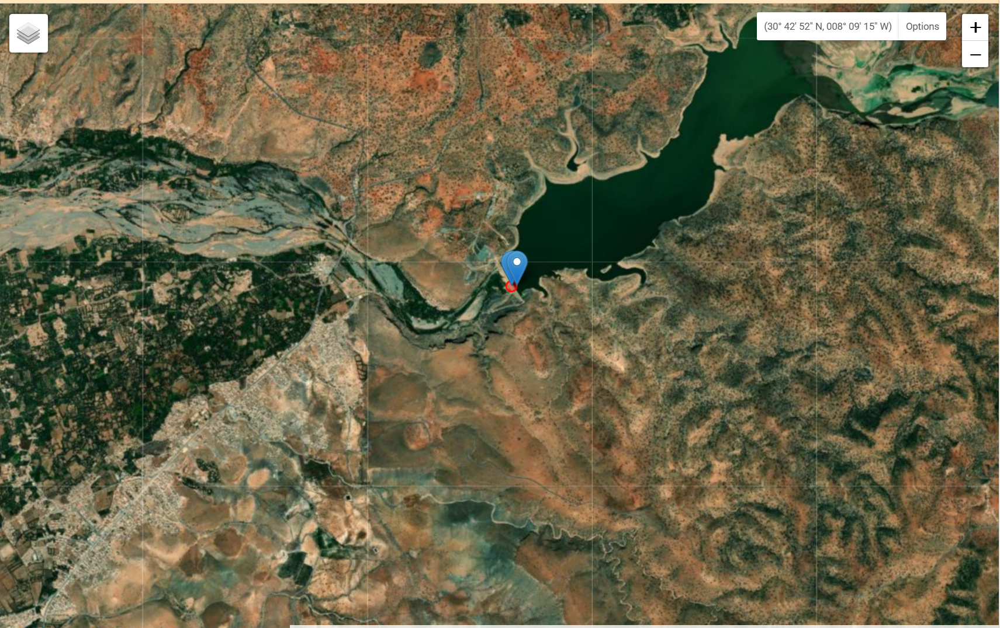
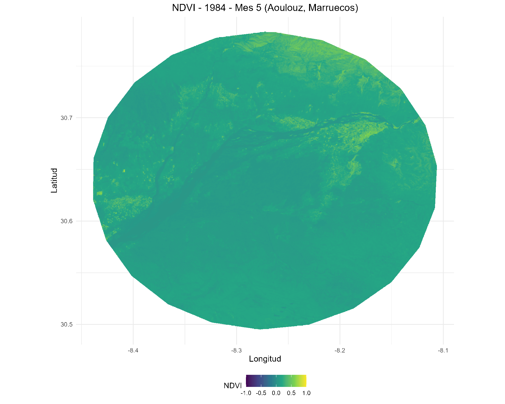
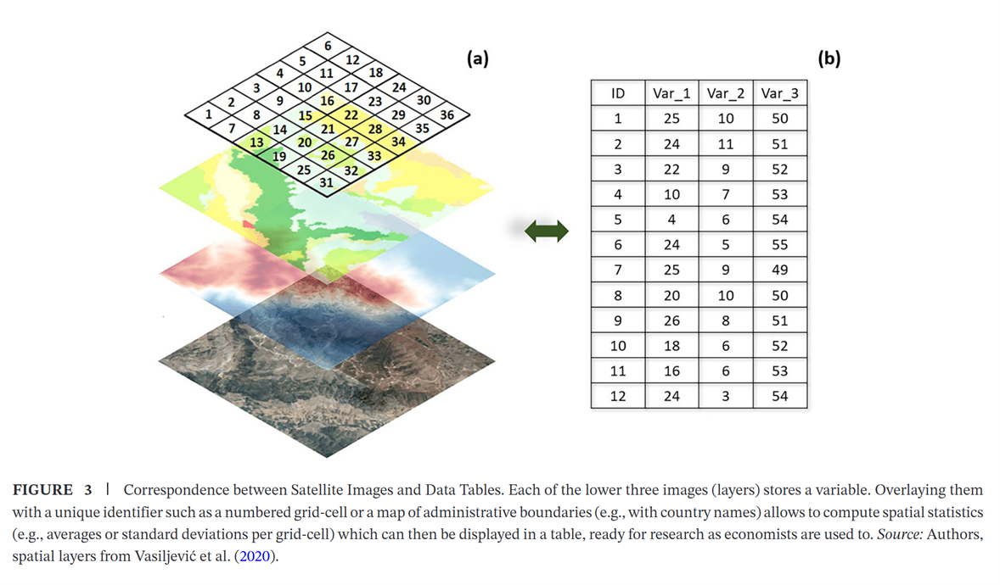
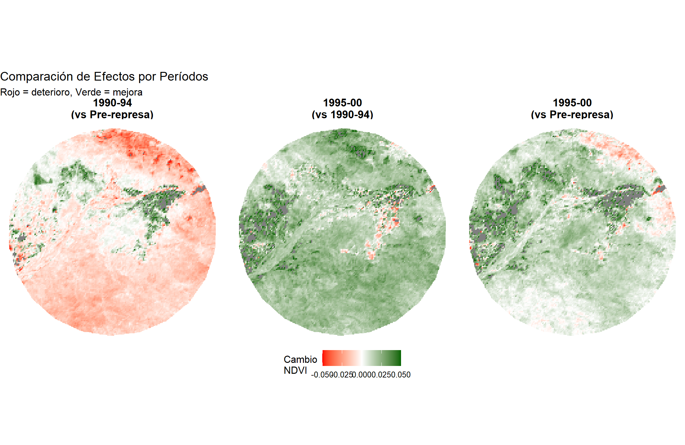
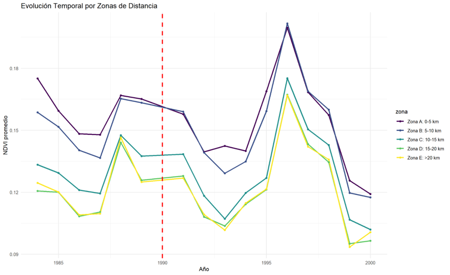
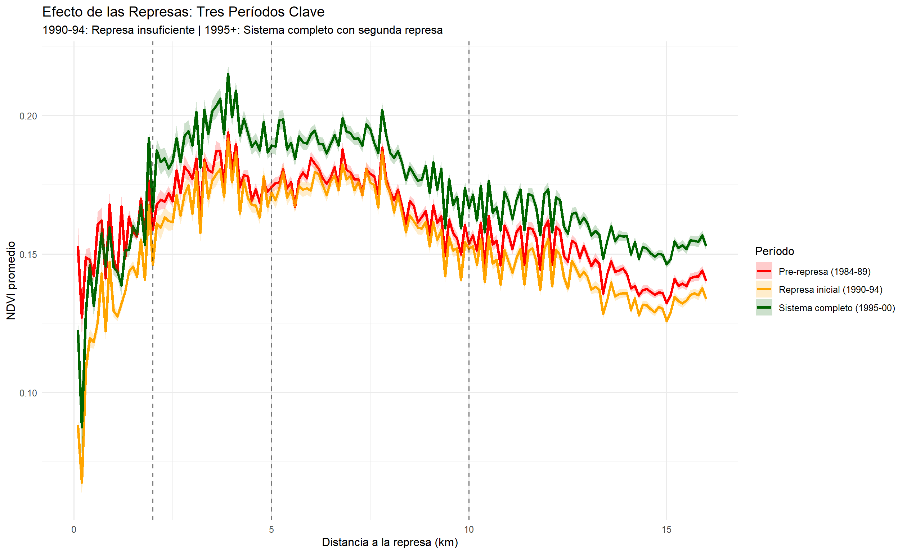

## Contexto

:::: {.columns}
::: {.column width="60%"}
-   Evaluar intervención sobre el acceso a un recurso
-   **💧 El agua configura realidades**:
    -   Migrar o permanecer en el territorio
    -   Invertir en la propia tierra
    -   Educación familiar
    -   Transformación del papel de la mujer
-   **Carácter histórico-cultural**: Las intervenciones hídricas dejan huella en la memoria colectiva
:::

::: {.column width="40%"}

*Pintura callejera en Agadir: memoria histórica de intervenciones hídricas*
:::
::::

---

## Marruecos: Frontera de Tres Mundos {background-image="imagenes/map_general_black.png" background-opacity="0.3"}

:::: {.columns}
::: {.column width="50%"}
### Posición Geopolítica

-   🌍 **Puerta de Europa** (14 km)
-   🏜️ **Límite del Sahara**
-   🌊 **Salida al Atlántico**

### El Desafío Climático

-   📈 **Aridización creciente**
-   🌡️ **Temperaturas en aumento**
-   💧 **Recursos hídricos limitados**
:::

::: {.column width="50%"}
:::
::::

---

## La Estrategia Nacional: Del Agua al "Hub" Agrícola Europeo {.smaller}

{width="95%"}

-   🏗️ **Infraestructura hídrica como base**: Presas y riego extensivo desde el siglo XX
-   🌱 **Transformación productiva**: De agricultura de subsistencia a cultivos de alto valor para exportación
-   🍊 **Especialización estratégica**: Frutas y hortalizas intensivas en agua pero altamente rentables
-   💰 **Ventaja competitiva**: Clima + proximidad + gestión hídrica = socio clave de Europa

---

## Caso: Represa de Aoulouz (1990) {.smaller}

:::: {.columns}
::: {.column width="50%"}
### Los Afectados

-   🚫 Sin acceso → Migración
-   💸 Pozos costosos → Endeudamiento

### Los Ganadores

-   🔗 Conectados → Modernización
-   🏔️ Montañas → Continuidad

### El Resultado

-   📊 Fragmentación socioeconómica
-   🏃‍♂️ Dinámicas migratorias
-   🌾 Transformación desigual
:::

::: {.column width="50%"}
{width="95%"}
:::
::::

::: {.fragment .fade-in}
**¿Cómo medimos este impacto complejo?**
:::

---

## El Dilema de la Medición {.smaller}

| **Método** | **✅ Ventajas** | **❌ Limitaciones** | **📊 Información** |
|------------------|------------------|------------------|------------------|
| **Encuestas** | Percepción directa, detalles cualitativos | Costosas, lentas, posibles sesgos | Experiencia subjetiva |
| **Producción** | Datos objetivos, comparables | Solo output final, no procesos | Toneladas/hectárea |
| **Administrativos** | Oficiales, consistentes | Pueden no reflejar realidad local | Consumo registrado |
| **🛰️ Satelitales** | Cobertura total, historia completa | Requiere interpretación técnica | **40+ años continuos** |

. . .

::: callout-tip
## La Oportunidad

Los datos satelitales nos permiten **reconstruir la historia** desde 1984, con cobertura total del territorio y metodología consistente.
:::

---

## La Era de los Datos Inteligentes {background-color="#2E5266"}

:::: {.columns}
::: {.column width="50%"}
Vivimos un momento único en la historia:

-   🛰️ **Acceso democratizado** a datos satelitales
-   💻 **Poder de procesamiento** masivo y barato
-   🤖 **IA como asistente** personal para análisis
-   🌍 **Cobertura global** con detalle sin precedentes
:::

::: {.column width="50%"}
{width="100%"}
:::
::::

. . .

::: {.callout-warning appearance="minimal"}
## ⚠️ cuidado...

**Los datos no son hechos automáticamente**. Es fundamental entender de dónde vienen, qué supuestos tienen y cuáles son sus limitaciones.
:::

---

## 40 Años de Memoria Satelital 

:::: {.columns}
::: {.column width="50%"}
{width="100%"}
:::

::: {.column width="50%"}
-   **1984**: 🛰️ Inicio archivo Landsat 5
-   **1990**: 🏗️ ⭐ **Culminación Represa Aoulouz**
-   **1994**: 🔗 Segunda represa conectada
-   **2003**: 🔥 Ola de calor extrema
-   **2023**: 🌍 Terremoto regional
-   **2024**: 📊 Análisis retrospectivo completo
:::
::::

---

## Del Espacio al Dato: Metodología {.smaller}

:::: {.columns}
::: {.column width="50%"}
{width="100%"}
:::

::: {.column width="50%"}
### Parámetros Técnicos

-   **🎯 Área**: Buffer 16km alrededor de Aoulouz
-   **📅 Período**: 1984-2024 (40 años)
-   **🗓️ Estacionalidad**: Mayo-Julio (temporada seca)
-   **☁️ Filtros**: Nubes, sombras, agua, nieve automáticamente removidos
-   **📏 Resolución**: 30 metros (≈ 1 hectárea por 11 píxeles)

### Control de Calidad

-   ✅ **Validación de rangos**: -1 ≤ NDVI ≤ 1
-   ✅ **Enmascaramiento inteligente**: QA_PIXEL Colección 2
-   ✅ **Compuestos robustos**: Media de múltiples imágenes
-   ✅ **Manejo de errores**: Continuidad ante archivos corruptos
:::
::::

---

## Resultados Preliminares {.smaller}

:::: {.columns}
::: {.column width="65%"}
{width="95%"}
:::

::: {.column width="33%"}
**1990-94: Primera represa**
🔴 Deterioro generalizado  
Primera represa insuficiente

**1995-00: La Corrección**
🟢 Recuperación masiva  
Segunda represa clave

**Balance Final**
🟡 Ganancia neta positiva  
Efectos heterogéneos
:::
::::

. . .

::: {.callout-important}
## ⚠️ 

**Una sola represa fue contraproducente**. Solo el **sistema completo** (dos represas) logró transformar la región. La infraestructura hídrica requiere **masa crítica** para ser efectiva. Pero en este proceso La geo se muestra que la geografía importa y que hay desigualdad espacial 
:::

---

## Proximidad y Transformación {.smaller}

:::: {.columns}
::: {.column width="100%"}
{width="90%"}
:::
::::

**Patrón común:**
- Tendencias paralelas
- 📉 Declive 1990-94
- 🚀 Pico 1996
- ✅ Niveles superiores a  línea base

---

## El Radio de Influencia {.smaller}

:::: {.columns}
::: {.column width="100%"}
{width="90%"}
:::
::::

🟢 Sistema completo domina  
- Efectos a larga distancia
- Declive pre-represa

. . .

::: {.callout-important}
## 🎯 Radio de Transformación
**5 km: zona de impacto principal** | **16 km: límite de influencia**. La primera represa fue completamente inútil en todas las distancias. El sistema completo genera beneficios medibles hasta los límites del área de estudio.
:::

---

## {background-color="#FF9587"}
::: {style="color: white;"}
### **Limitaciones Técnicas** {style="color: white;"}
-   **Resolución espacial**: 30m puede omitir detalles de parcelas pequeñas
-   **Factores atmosféricos**: Nubes reducen disponibilidad de datos
-   **Interpretación**: NDVI ≠ Productividad económica directa

### **Limitaciones Metodológicas** {style="color: white;"}
-   **Correlación vs. Causalidad**: Mostramos patrones, no mecanismos
-   **Variables omitidas**: Políticas, mercados, decisiones individuales

### 💡 **Implicaciones** {style="color: white;"}
-   Los resultados deben **contextualizarse** con conocimiento local
-   Necesario **triangular** con otras fuentes de información
-   Ideal para **generar hipótesis**, no para probar causalidad definitiva
:::

---

## Próximos Pasos: Escalando el Análisis {.smaller}

### 🚀 **Exploración Técnica**

1.  **Mayor resolución**: Sentinel-2 (10m) para análisis post-2015
2.  **Múltiples índices**: NDWI (agua), EVI (vegetación mejorado)\
3.  **Deep learning**: Clasificación automática de tipos de cultivo

### 🏗️️ **Integración de Datos**

4.  **Validación de campo**: Entrevistas en zonas de alto/bajo cambio
5.  **Datos socioeconómicos**: Censos, migración, ingresos
6.  **Variables climáticas**: Precipitación, temperatura, sequías
7.  **Políticas públicas**: Timeline de intervenciones gubernamentales

###  🌍 **Escalabilidad**

-   **Otras represas** en Souss-Massa
-   **Regiones similares** en Marruecos\
-   **Contexto regional**: Norte de África
-   **Comparación global**: Proyectos similares

---

## Gracias {.center background-color="#2E5266"}

---

---

## Detalles Técnicos Adicionales {.appendix .smaller}

### 

**Especificaciones de Procesamiento:** - Plataforma: Google Earth Engine (Python API) - Colección: LANDSAT/LT05/C02/T1_L2 (Nivel 2, Reflectancia de Superficie) - Filtros QA: Bits 1,2,3,4 para nubes, sombras, agua, nieve - Proyección: EPSG:4326 (WGS84) - Formato exportación: GeoTIFF, 30m resolución

**Estadísticas del Dataset:** - Total de imágenes procesadas: 847 - Período de análisis: 480 meses - Píxeles por imagen: \~280,000\
- Cobertura temporal: 83% (excluyendo períodos nublados)

